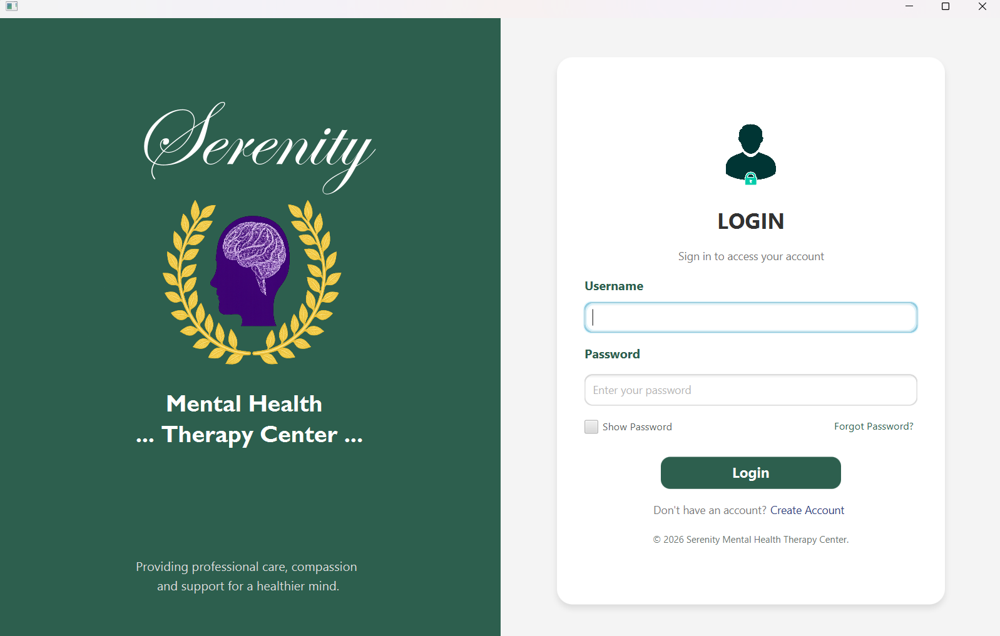
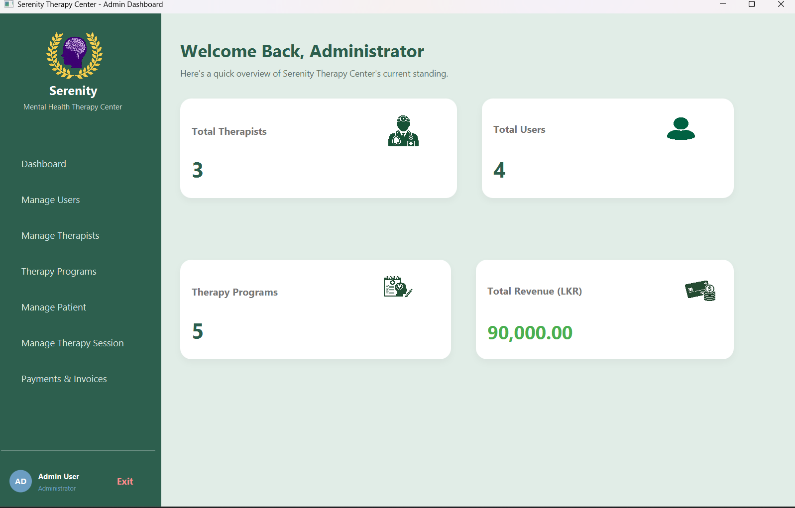
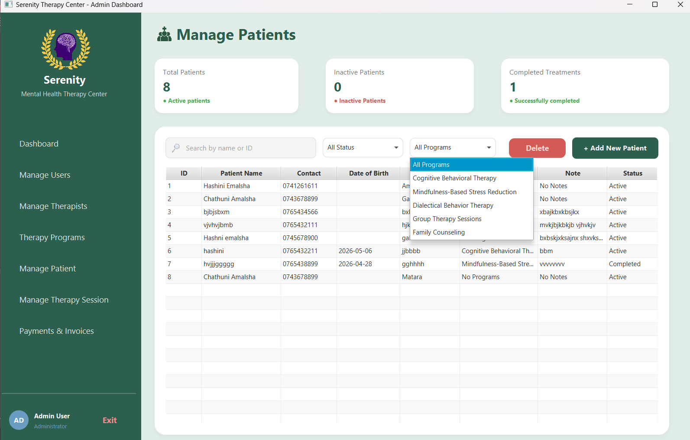
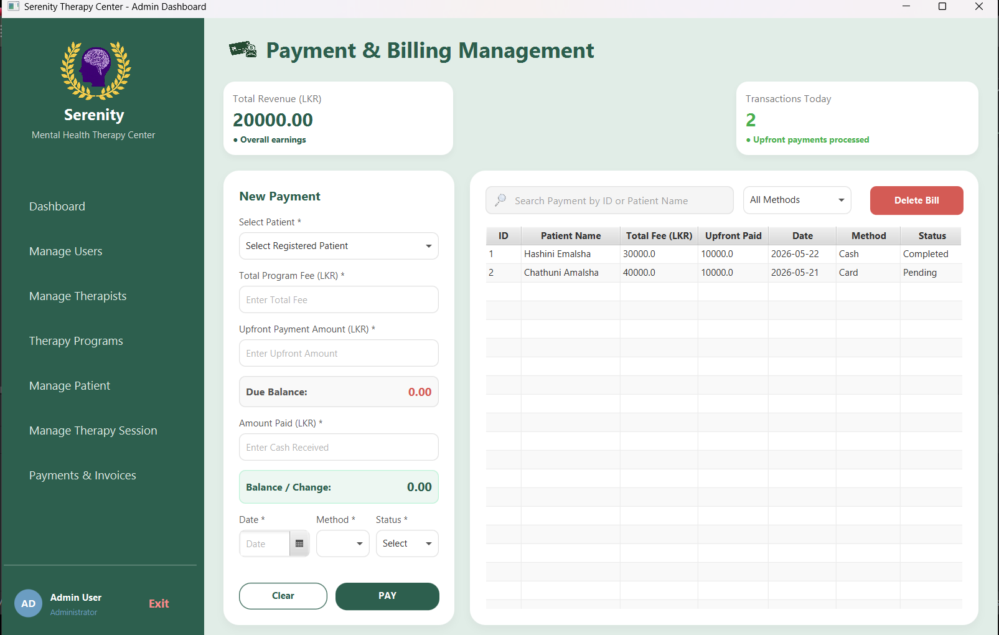
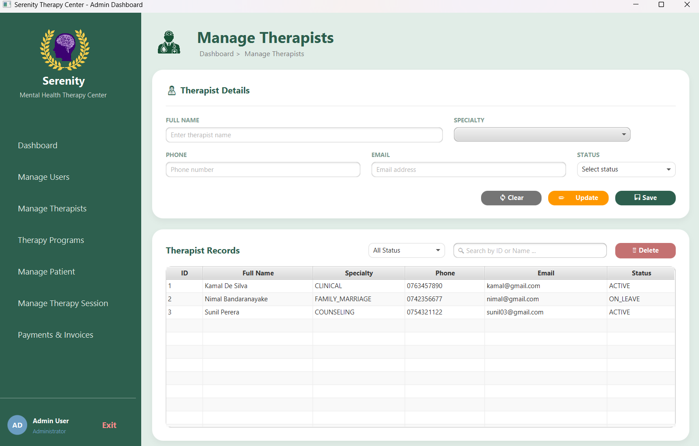
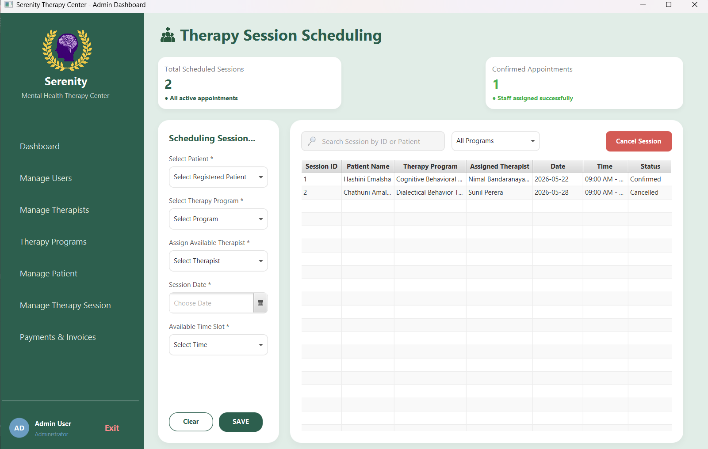
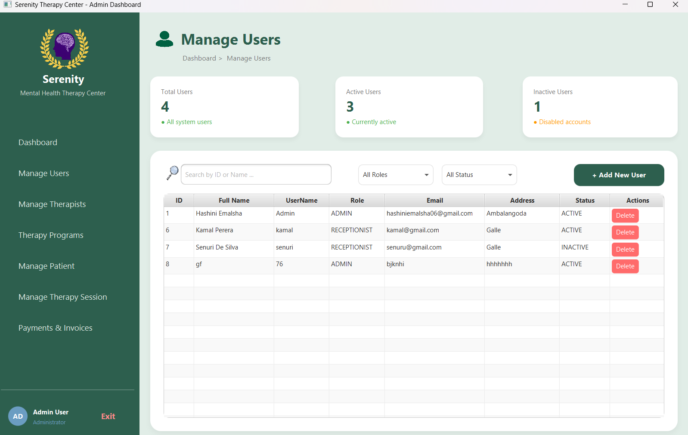

# 🌿 Serenity Therapy Center Management System

A Desktop-based Serenity Therapy Center Management System developed using JavaFX, Hibernate ORM, and MySQL. This project was created to demonstrate modern enterprise application development concepts, including Object Relational Mapping (ORM), layered architecture, database management, and user-friendly desktop interfaces.

## 📖 Overview

The Serenity Therapy Center Management System is designed to streamline the administration of a therapy center by managing patients, therapists, therapy programs, therapy sessions, payments, and system users. The application follows industry-standard software development practices using Hibernate ORM and JavaFX.

## ✨ Features

### 👤 Patient Management

* Add, update, search, and delete patient records
* Maintain patient information securely

### 👨‍⚕️ Therapist Management

* Manage therapist details and availability
* Track therapist assignments

### 🧠 Therapy Program Management

* Create and manage therapy programs
* Maintain program information and pricing

### 📅 Therapy Session Management

* Schedule and manage therapy sessions
* Associate patients, therapists, and therapy programs

### 💳 Payment Management

* Record and manage payments
* Monitor financial transactions

### 🔐 User Management

* Secure login system
* User account administration
* Password validation and security utilities

<p align="center">
  
  
</p>

<p align="center">
  
  
</p>

<p align="center">
  
  
</p>

<p align="center">
  
</p>

## 🏗️ Technologies Used

| Technology      | Purpose                   |
| --------------- | ------------------------- |
| Java 21         | Core Programming Language |
| JavaFX          | Desktop User Interface    |
| Hibernate ORM   | Object Relational Mapping |
| JPA Annotations | Database Entity Mapping   |
| MySQL           | Relational Database       |
| Maven           | Dependency Management     |
| Ehcache         | Hibernate Caching         |
| IntelliJ IDEA   | Development Environment   |

## 🗂️ System Architecture

The project follows a layered architecture:

```text
Presentation Layer (JavaFX UI)
            ↓
Business Layer (BO)
            ↓
Data Access Layer (DAO)
            ↓
Database Layer (MySQL + Hibernate ORM)
```

## 📊 Core Entities

* Patient
* Therapist
* Therapy Program
* Therapy Session
* Payment
* User

## 🎯 Learning Outcomes

This project demonstrates:

* Hibernate ORM Fundamentals
* Entity Relationships
* CRUD Operations
* Session & Transaction Management
* JavaFX Application Development
* DAO & BO Design Patterns
* Database Integration with MySQL
* Enterprise Application Architecture

## ⚙️ Prerequisites

Before running the project, ensure you have:

* Java JDK 21 or later
* MySQL Server
* Maven
* IntelliJ IDEA (Recommended)

## 🚀 Running the Project

### Clone the Repository

```bash
git clone <repository-url>
```

### Navigate to the Project

```bash
cd ORM-Project
```

### Configure Database

Update the database configuration according to your MySQL setup.

### Run the Application

```bash
mvn javafx:run
```

## 📚 Academic Purpose

This project was developed as part of Advanced Application Development and ORM learning activities to gain hands-on experience with Hibernate ORM, JavaFX, and enterprise-level application development.

## 👩‍💻 Developer

**Hashini Emalsha**

---

⭐ A practical implementation of Hibernate ORM concepts through a real-world Therapy Center Management System.
